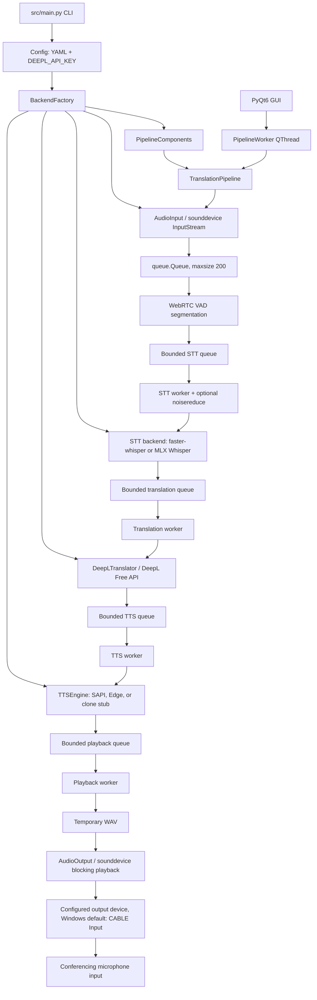

# Architecture

## CURRENT ARCHITECTURE — PHASE 5 + BIDIRECTIONAL MAC GUI

This section describes the code currently present in `src/`. Phase 5 keeps the
Phase 4 backend choices while moving the live STT, translation, TTS, and
playback stages onto an ordered bounded worker chain.

### Current runtime flow

`src/main.py` parses `live`, `gui`, `dryrun`, `test`, `beep`, and `list-devices` modes. Device listing is handled before importing configuration or the pipeline, so it does not load AI or TTS backends. Other modes load configuration, initialize logging, and construct `TranslationPipeline`. GUI mode creates the same pipeline in a `QThread`.

GUI mode can additionally start `IncomingSubtitlePipeline`. It captures only
the conference-output loop from BlackHole 16ch, segments it independently,
runs English Faster Whisper and EN-to-TR DeepL workers, and emits subtitle pairs
to Qt. A shared narrow STT filter suppresses whole-segment Whisper boilerplate
such as “Thank you”/“Subtitles by M.K.” and low-diversity repeated-character or
repeated-word output before either pipeline reaches translation. Normal
sentences that merely contain one of those phrases remain intact. This channel
has no TTS or audio output, so it cannot feed remote speech back to Zoom. The
two paths use distinct virtual devices: BlackHole 2ch for the outgoing Zoom
microphone and BlackHole 16ch for incoming subtitles.

In live mode, PortAudio invokes the `AudioInput` callback and enqueues PCM chunks. The pipeline loop continuously reads chunks, passes them to `VAD`, and submits completed segments to `PipelineRuntime`. One worker per stage preserves FIFO order while allowing different segments to occupy STT, translation, TTS, and playback concurrently. `process_segment()` remains as a synchronous compatibility path for direct callers and deterministic tests.

### Main modules

| Module | Current responsibility |
| --- | --- |
| `src/main.py` | CLI entry point, mode selection, configuration and logging startup |
| `src/pipeline.py` | Coordinates injected components for all live/dry-run/test processing |
| `src/incoming_subtitles.py` | Bounded English-audio-to-Turkish-subtitle channel with no playback stage |
| `src/pipeline_runtime.py` | Ordered stage messages, bounded FIFO queues, workers, shutdown, backpressure, and metrics |
| `src/backend_interfaces.py` | Minimal ABC contracts for STT, translation, audio input, and audio output |
| `src/backend_factory.py` | Lazily maps compatible configuration to current concrete components |
| `src/runtime_platform.py` | Pure, testable OS/architecture capabilities and virtual-routing hints |
| `src/stt_mlx.py` | Apple Silicon MLX Whisper adapter with in-memory PCM conversion |
| `src/stt_metrics.py` | Turkish-aware normalization plus deterministic WER/CER helpers |
| `src/config.py` | Loads YAML and reads `DEEPL_API_KEY` from the environment via dotenv |
| `src/devices.py` | Enumerates `sounddevice` devices and selects by index, substring, or default |
| `src/audio_in.py` | Callback-based input stream and bounded in-memory chunk queue |
| `src/vad.py` | WebRTC VAD framing and silence/max-duration segmentation |
| `src/stt_whisper.py` | Turkish faster-whisper transcription and CPU/CUDA selection |
| `src/translate_deepl.py` | DeepL Free API calls, retries, timeout, and in-memory LRU cache |
| `src/tts_base.py` | Existing abstract interface for TTS engines |
| `src/tts_sapi.py` | Windows SAPI synthesis through PowerShell plus WAV resampling |
| `src/tts_edge.py` | Edge TTS synthesis and MP3-to-WAV conversion fallback |
| `src/tts_clone_stub.py` | Nonfunctional placeholder backend |
| `src/audio_out.py` | WAV loading, mono conversion, linear resampling, and `sounddevice` playback |
| `src/ui/gui_main.py` | PyQt6 window, pipeline worker thread, and log-driven UI updates |
| `src/ui/gui_overlay.py` | Always-on-top timed subtitle overlay |
| `src/utils.py` | Rotating file/console logging and temporary-directory helpers |

### Audio input

`AudioInput` opens a `sounddevice.InputStream` for a selected numeric device index. Its callback converts data to `int16` and pushes mono byte chunks into `queue.Queue(maxsize=200)`. Legacy/default inputs continue taking the first channel; the incoming conference profile explicitly opts into stereo-to-mono averaging so speech panned to either side remains visible. A PortAudio callback cannot block safely; if this queue is full, it preserves older queued speech, rejects the current chunk, increments a visible counter, and logs an error. Each live channel detects a new rejection and stops with `PipelineBackpressureError` instead of continuing with an undisclosed continuity gap. Device selection supports an explicit index, a case-insensitive name substring, or the current system default.

### VAD

`VAD` uses `webrtcvad` with 10/20/30 ms PCM frames at supported rates. It accumulates speech plus trailing silence and emits a segment after the configured silence threshold or maximum segment duration. Segments shorter than the configured minimum total duration are discarded. It does not preserve incomplete samples between calls when a chunk is not an exact multiple of the frame size.

### STT

`SpeechToTextBackend` defines only `transcribe(audio_bytes, sample_rate)`.
`STTWhisper` remains the default/reference implementation and directly constructs
`faster_whisper.WhisperModel`; its Turkish, CPU/CUDA, compute-type fallback, and
in-memory 16 kHz conversion behavior are unchanged. `MLXWhisperBackend` is an
explicit Apple Silicon-only alternative. It converts the same mono PCM16 bytes
to a normalized NumPy waveform, resamples in memory when needed, preloads the
exact configured MLX model, and calls `mlx_whisper.transcribe` without a temporary
WAV. `mlx-whisper 0.4.3` has no beam-search decoder, so configured `beam_size: 1`
maps explicitly to temperature-zero greedy decoding; other beam sizes fail
clearly. MLX model preload and inference share one explicitly cross-thread Metal
stream guarded by the backend lock, because regular MLX streams cannot move from
factory construction to the Phase 5 STT worker. Concrete imports and model
construction remain lazy, and selecting MLX never silently falls back to Faster
Whisper or changes the model identifier.

### Translation

`TranslatorBackend` defines only `translate(text)`. The current `DeepLTranslator` implementation posts text to the DeepL Free endpoint and sends the API key only through the required `Authorization: DeepL-Auth-Key ...` header. Optional configuration-driven DeepL context and custom instructions can disambiguate explicitly named people or domain terms without sending transcript history. They are part of the translation cache key. Private terms belong only in the ignored local configuration; the checked-in example contains placeholders. The translator retries timeouts, rate limits, and server failures with backoff, and caches translations in memory. Separate instances use TR-to-EN for outgoing speech and EN-to-TR for incoming subtitles. The factory, rather than either pipeline, selects them and refuses to construct them without `DEEPL_API_KEY`.

### TTS

TTS retains the existing `TTSEngine` abstract base; no redundant TTS interface was added. The configured concrete engine is SAPI, Edge, or the unavailable clone stub. SAPI is the default and shells out to Windows PowerShell/System.Speech. Edge uses the network-backed `edge-tts` package and may require `pydub` plus `ffmpeg` when its output is MP3. Windows preserves the existing unavailable-engine fallback to SAPI. On non-Windows platforms, selecting SAPI or reaching an unavailable-engine SAPI fallback now fails explicitly instead of returning an unusable Windows engine.

### Audio output

`AudioInputBackend` and `AudioOutputBackend` capture the operations the pipeline actually uses. The existing `AudioInput` and `AudioOutput` implementations remain sounddevice-based. `AudioInput.dropped_chunk_count()` exposes callback saturation without exposing queue internals. `clear_queue()` remains on the compatibility interface but the Phase 5 pipeline no longer calls it. `AudioOutput` still reads an entire WAV, converts multichannel input to mono, linearly resamples to the configured device rate, and calls blocking `sounddevice.play`; playback blocking is isolated to its worker. The primary Mac profile targets BlackHole 2ch, while the cross-platform example retains `CABLE Input` for VB-CABLE.

### GUI

`gui_main.py` presents separate outgoing and incoming transcript cards, explicit route labels, a primary start/stop-and-close control, a dedicated idle exit control, a compact event log, and an optional always-on-top incoming Turkish subtitle overlay. Outgoing audio and incoming subtitles run in separate `QThread` owners. Incoming subtitle pairs use a Qt signal rather than log parsing; outgoing card updates consume channel-qualified pipeline log events. Stop requests are dispatched outside the Qt event loop, and the GUI polls both worker states until cancellation completes so a blocking audio stop cannot freeze the window. While live, the primary control explicitly cancels active work and closes after both workers finish.

### Configuration

`Config` loads `config.yaml` by default and overlays only the `DEEPL_API_KEY` environment value. The checked-in deployment profile explicitly targets the primary Mac with the built-in microphone, BlackHole 2ch output, `mlx-community/whisper-large-v3-turbo`, and an enabled BlackHole 16ch incoming subtitle channel using Faster Whisper small. The cross-platform example keeps `incoming_subtitles.enabled: false`, so existing Windows and selector-free configurations retain their one-way behavior. Factory defaults and older sample-rate/VAD keys remain compatible. Invalid explicit backend names fail clearly. The application still does not validate the complete schema before component construction.

### Error handling

Component initialization generally raises to `main.py`, which logs and exits. Runtime STT, translation, TTS, and playback methods usually log errors and return `None` or `False`. DeepL has bounded retries. A failed stage marks that segment failed and allows later sequence IDs to continue; callback exceptions are contained so they cannot kill a stage worker. Queue saturation and worker shutdown timeout raise explicitly. Normal stop closes capture, drains queued raw audio and VAD state, then propagates an ordered sentinel through every worker. Explicit cancellation records canceled messages. GUI worker exceptions are logged and signaled as completion.

### Current concurrency model

- PortAudio/sounddevice invokes the input callback outside the pipeline loop.
- The capture queue and all four stage queues are bounded.
- A single worker per stage preserves sequence order; stages can overlap across different segments.
- Backpressure blocks between internal stages. Ingress saturation stops capture visibly after a configurable timeout; the rejected current segment is retried during bounded shutdown drain before the sentinel, so accepted speech is not evicted.
- Normal programmatic stop drains; the GUI Stop action uses `stop(cancel=True)`, interrupts active sounddevice playback, and visibly cancels queued work so a stale playback backlog cannot hold the interface open. Queue depth/high-water, stage totals/counts, completion/failure/cancel counts, and last end-to-end latency are observable through `runtime_metrics()` and final logs.
- GUI mode still owns `run_live()` in one `QThread`; the four pipeline workers run beneath it, blocking playback no longer blocks capture/VAD consumption, and the stop button requests shutdown without blocking the Qt event loop.
- When incoming subtitles are enabled, a second QThread owns its capture loop and two bounded workers; outgoing and incoming queue metrics remain separate.

### Current platform handling

`RuntimePlatform` normalizes macOS, Windows, Linux, and other systems and exposes deterministic facts for Apple Silicon, SAPI support, CUDA configuration relevance, and the expected virtual-routing family (`blackhole` or `vb-cable`). These hints do not override user device configuration. Platform capability prevents invalid non-Windows SAPI selection/fallback and gates the MLX Whisper backend to Apple Silicon macOS.

Remaining platform assumptions are:

- Documentation, `install.bat`, and `run.bat` target Windows and PowerShell.
- SAPI through `System.Speech` remains the default TTS and Windows fallback.
- The cross-platform example still defaults to VB-CABLE's `CABLE Input`; `devices.txt` records Windows MME, DirectSound, WASAPI, and WDM-KS devices.
- Installation guidance includes Visual C++ Build Tools and a CUDA 11.8 PyTorch index.
- Faster Whisper retains its CPU/CUDA paths; the MLX Whisper implementation is isolated to Apple Silicon/Metal and does not carry CUDA assumptions.
- Edge TTS conversion assumes `ffmpeg` is available to `pydub` when MP3 conversion is needed.
- `requirements.txt` and the UTF-16-generated `requirements_freeze.txt` remain Windows-oriented. The verified Python 3.11 Apple Silicon environment instead uses `requirements-macos-stt.txt` plus `requirements-macos-app.txt`; Python 3.14 remains unvalidated.

### Known architectural risks

- Capture callbacks must reject the current chunk if their raw queue is completely full; this is visible and stops the live run, but the lost chunk cannot be recovered.
- Bounded queues cap memory but sustained downstream slowness can deliberately stop ingress rather than degrade continuity silently.
- A backend call that never returns cannot be force-killed by Python threads; shutdown times out visibly, while the daemon worker may remain until process exit.
- A GUI stop requested during model/component construction is latched and prevents capture from starting, but it cannot interrupt the constructor already in progress.
- Component constructors still have observable side effects; the factory preserves the legacy order of device queries, VAD, model loading, DeepL validation, and TTS probing.
- Device indexes are supported as persistent configuration even though operating systems can reorder them, and substring selection takes the first match.
- No non-Windows TTS fallback exists; an unavailable engine fails startup explicitly outside Windows.
- Incoming GUI subtitles use structured Qt signals, while outgoing card updates still depend on channel-qualified pipeline log events.
- Automated tests cover both channel directions, GUI card isolation, ordering, saturation, failure containment, drain/cancel shutdown, callback failure, temp cleanup, capture overflow policy, backend contracts, MLX waveform conversion, factory/platform policy, Turkish WER/CER, and Phase 2 diagnostics. Bounded real Mac integration checks cover outgoing MLX/DeepL/Edge/BlackHole and incoming BlackHole/Faster Whisper/DeepL paths, but no sustained two-person Zoom or thermal/load run exists yet.

## BACKEND STATUS

### IMPLEMENTED NOW

- `SpeechToTextBackend` → `STTWhisper` using faster-whisper.
- `SpeechToTextBackend` → `MLXWhisperBackend` using `mlx-whisper` on Apple Silicon.
- `TranslatorBackend` → `DeepLTranslator` using the DeepL Free endpoint.
- Existing `TTSEngine` → `SapiTTSEngine`, `EdgeTTSEngine`, or the existing unavailable `CloneTTSEngineStub`.
- `AudioInputBackend` / `AudioOutputBackend` → existing sounddevice implementations.
- `BackendFactory` → compatible config selection with lazy concrete imports.
- `PipelineComponents` → complete constructor injection for deterministic tests.
- `RuntimePlatform` → isolated, deterministic platform capability facts.
- `PipelineRuntime` → ordered bounded STT/translation/TTS/playback workers with explicit backpressure and lifecycle metrics.
- `IncomingSubtitlePipeline` → separate bounded English STT and Turkish translation workers with no playback route.

ABCs were chosen for the new contracts because the repository already used an
ABC for TTS. This keeps the boundary explicit without adding a framework.

### FUTURE BACKENDS — NOT IMPLEMENTED

- Streaming/incremental STT and any automatic backend fallback policy.
- Local or hybrid LLM translation.
- A local or streaming macOS-capable TTS implementation.

The factory compatibility default remains Faster Whisper. The primary Mac
deployment profile explicitly selects `mlx-community/whisper-large-v3-turbo`;
Windows and selector-free configurations retain Faster Whisper. See
`docs/BENCHMARKS.md`.

## PROPOSED V2 DIRECTION

The remaining direction is to validate the concurrent live path under sustained real meetings, then evaluate local or streaming TTS and optional local/hybrid translation without removing the Windows implementations. See `docs/MAC_V2_PLAN.md`.
