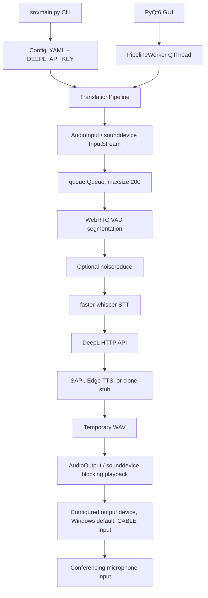

# Architecture

## CURRENT ARCHITECTURE

This section describes the code currently present in `src/`. It does not describe a completed macOS implementation.

### Current runtime flow

`src/main.py` parses `live`, `gui`, `dryrun`, `test`, `beep`, and `list-devices` modes. Except for device listing, it loads configuration, initializes logging, and constructs `TranslationPipeline`. GUI mode creates the same pipeline in a `QThread`.

In live mode, PortAudio invokes the `AudioInput` callback and enqueues PCM chunks. The pipeline loop reads chunks, passes them to `VAD`, and calls `process_segment` when a segment completes. That method performs optional noise reduction, STT, translation, TTS file generation, and blocking playback in sequence. No later segment is processed while these stages run.

### Main modules

| Module | Current responsibility |
| --- | --- |
| `src/main.py` | CLI entry point, mode selection, configuration and logging startup |
| `src/pipeline.py` | Constructs concrete components and coordinates all live/dry-run/test processing |
| `src/config.py` | Loads YAML and reads `DEEPL_API_KEY` from the environment via dotenv |
| `src/devices.py` | Enumerates `sounddevice` devices and selects by index, substring, or default |
| `src/audio_in.py` | Callback-based input stream and bounded in-memory chunk queue |
| `src/vad.py` | WebRTC VAD framing and silence/max-duration segmentation |
| `src/stt_whisper.py` | Turkish faster-whisper transcription and CPU/CUDA selection |
| `src/translate_deepl.py` | DeepL Free API calls, retries, timeout, and in-memory LRU cache |
| `src/tts_base.py` | Existing abstract interface for TTS engines |
| `src/tts_sapi.py` | Windows SAPI synthesis through PowerShell plus WAV resampling |
| `src/tts_edge.py` | Edge TTS synthesis and MP3-to-WAV conversion fallback |
| `src/tts_clone_stub.py` | Nonfunctional placeholder backend |
| `src/audio_out.py` | WAV loading, mono conversion, linear resampling, and `sounddevice` playback |
| `src/ui/gui_main.py` | PyQt6 window, pipeline worker thread, and log-driven UI updates |
| `src/ui/gui_overlay.py` | Always-on-top timed subtitle overlay |
| `src/utils.py` | Rotating file/console logging and temporary-directory helpers |

### Audio input

`AudioInput` opens a `sounddevice.InputStream` for a selected numeric device index. Its callback converts data to `int16`, keeps only the first channel when input is multichannel, and pushes byte chunks into `queue.Queue(maxsize=200)`. When full, it drops up to ten oldest chunks and may drop the current chunk. Device selection supports an explicit index, a case-insensitive name substring, or the current system default.

### VAD

`VAD` uses `webrtcvad` with 10/20/30 ms PCM frames at supported rates. It accumulates speech plus trailing silence and emits a segment after the configured silence threshold or maximum segment duration. Segments shorter than the configured minimum total duration are discarded. It does not preserve incomplete samples between calls when a chunk is not an exact multiple of the frame size.

### STT

`STTWhisper` directly constructs `faster_whisper.WhisperModel`. It is configured for Turkish by default, converts input to 16 kHz with linear interpolation when needed, and joins returned segment text. Device handling recognizes CPU and CUDA; there is no Apple-specific backend abstraction today.

### Translation

`DeepLTranslator` is the only implemented translator. It posts text and the API key to the DeepL Free endpoint, retries timeouts, rate limits, and server failures with backoff, and caches translations in memory. `TranslationPipeline` depends directly on this concrete class and refuses to initialize without `DEEPL_API_KEY`.

### TTS

TTS already has the `TTSEngine` abstract base. The configured concrete engine is SAPI, Edge, or the unavailable clone stub. SAPI is the default and shells out to Windows PowerShell/System.Speech. Edge uses the network-backed `edge-tts` package and may require `pydub` plus `ffmpeg` when its output is MP3. If the selected engine reports unavailable, the pipeline always falls back to SAPI, which is not useful on macOS.

### Audio output

`AudioOutput` reads an entire WAV, converts multichannel input to mono, linearly resamples to the configured device rate, and calls `sounddevice.play`. Current pipeline calls use blocking playback. The default configuration targets `CABLE Input` at 48 kHz for VB-CABLE routing into Zoom.

### GUI

`gui_main.py` runs `TranslationPipeline.run_live()` in one `QThread`, keeping the Qt event loop responsive. It parses log message text to update the subtitle overlay, coupling display behavior to exact log strings. The overlay uses platform-neutral PyQt APIs but specifies Windows-oriented fonts such as Segoe UI/Consolas.

### Configuration

`Config` loads `config.yaml` by default and overlays only the `DEEPL_API_KEY` environment value. The example YAML contains nested audio, VAD, STT, translation, TTS, logging, and pipeline settings, including compatibility keys for older sample-rate and VAD names. The application does not validate the complete schema before component construction.

### Error handling

Component initialization generally raises to `main.py`, which logs and exits. Runtime STT, translation, TTS, and playback methods usually log errors and return `None` or `False`. DeepL has bounded retries. The live loop re-raises unexpected exceptions after logging, then flushes VAD and stops input in `finally`. GUI worker exceptions are logged and signaled as completion.

### Current concurrency model

- PortAudio/sounddevice invokes the input callback outside the synchronous processing loop.
- A bounded `queue.Queue` bridges capture and processing.
- The live pipeline consumes and processes one segment at a time; STT, translation, TTS, and playback are serial and playback is blocking.
- GUI mode places that same serial pipeline in a single `QThread`; it does not create per-stage workers.
- Audio captured while a segment is processed accumulates until queue limits or explicit clearing discard it.

### Current platform assumptions

- Documentation, `install.bat`, and `run.bat` target Windows and PowerShell.
- SAPI through `System.Speech` is the default TTS and fallback.
- The configured output name defaults to VB-CABLE's `CABLE Input`; `devices.txt` records Windows MME, DirectSound, WASAPI, and WDM-KS devices.
- Installation guidance includes Visual C++ Build Tools and a CUDA 11.8 PyTorch index.
- STT exposes CPU/CUDA only; there is no Core ML, Metal, or MLX backend.
- Edge TTS conversion assumes `ffmpeg` is available to `pydub` when MP3 conversion is needed.
- Dependency pins and the UTF-16-generated `requirements_freeze.txt` reflect a Windows environment and have not been validated for Python 3.14 or Apple Silicon.

### Known architectural risks

- `process_segment` clears the input queue when backlog exceeds 50 chunks, and `run_live` clears it again after every processed segment. `AudioInput` also drops chunks on queue overflow. Captured speech can therefore be silently lost under load.
- Serial network/model/synthesis/playback work allows backlog to build during every segment.
- Concrete STT and translation implementations are constructed inside the central pipeline; only TTS has an explicit interface.
- Device indexes are supported as persistent configuration even though operating systems can reorder them, and substring selection takes the first match.
- TTS fallback is hard-coded to a Windows-only implementation.
- Queue depth and capture-to-playback latency are not recorded as first-class metrics.
- GUI subtitle updates depend on parsing log text rather than structured events.
- No automated test suite is present in the repository.

## PROPOSED V2 DIRECTION

The proposed direction is to preserve the Windows implementation while introducing platform and backend boundaries, then bounded stage queues/workers with explicit backpressure, ordered output, observability, and clean shutdown. macOS audio routing, Apple Silicon STT, local or streaming TTS, and optional local/hybrid translation remain candidates to validate in later phases; none are implemented by STEP 0. See `docs/MAC_V2_PLAN.md`.
