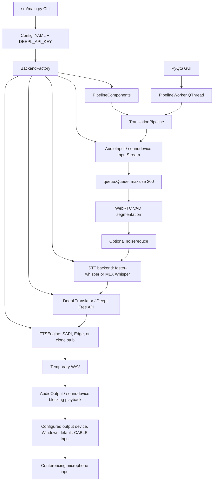

# Architecture

## CURRENT ARCHITECTURE — PHASE 4

This section describes the code currently present in `src/`. Phase 4 adds an
explicit Apple Silicon MLX Whisper implementation behind the Phase 3 STT
boundary while preserving the synchronous pipeline and Faster Whisper default.

### Current runtime flow

`src/main.py` parses `live`, `gui`, `dryrun`, `test`, `beep`, and `list-devices` modes. Device listing is handled before importing configuration or the pipeline, so it does not load AI or TTS backends. Other modes load configuration, initialize logging, and construct `TranslationPipeline`. GUI mode creates the same pipeline in a `QThread`.

In live mode, PortAudio invokes the `AudioInput` callback and enqueues PCM chunks. The pipeline loop reads chunks, passes them to `VAD`, and calls `process_segment` when a segment completes. That method performs optional noise reduction, STT, translation, TTS file generation, and blocking playback in sequence. No later segment is processed while these stages run.

### Main modules

| Module | Current responsibility |
| --- | --- |
| `src/main.py` | CLI entry point, mode selection, configuration and logging startup |
| `src/pipeline.py` | Coordinates injected components for all live/dry-run/test processing |
| `src/backend_interfaces.py` | Minimal ABC contracts for STT, translation, audio input, and audio output |
| `src/backend_factory.py` | Lazily maps compatible configuration to current concrete components |
| `src/runtime_platform.py` | Pure, testable OS/architecture capabilities and virtual-routing hints |
| `src/stt_mlx.py` | Apple Silicon MLX Whisper adapter with in-memory PCM conversion |
| `src/stt_metrics.py` | Turkish-aware normalization plus deterministic WER/CER helpers |
| `src/config.py` | Loads YAML and reads `DEEPL_API_KEY` from the environment via dotenv |
| `src/devices.py` | Enumerates `sounddevice` devices and selects by index, substring, or default |
| `src/audio_in.py` | Callback-based input stream and bounded in-memory chunk queue |
| `src/vad.py` | WebRTC VAD framing and silence/max-duration segmentation |
| `src/stt_whisper.py` | Turkish faster-whisper transcription and CPU/CUDA selection |
| `src/translate_deepl.py` | DeepL Free API calls, retries, timeout, and in-memory LRU cache |
| `src/tts_base.py` | Existing abstract interface for TTS engines |
| `src/tts_sapi.py` | Windows SAPI synthesis through PowerShell plus WAV resampling |
| `src/tts_edge.py` | Edge TTS synthesis and MP3-to-WAV conversion fallback |
| `src/tts_clone_stub.py` | Nonfunctional placeholder backend |
| `src/audio_out.py` | WAV loading, mono conversion, linear resampling, and `sounddevice` playback |
| `src/ui/gui_main.py` | PyQt6 window, pipeline worker thread, and log-driven UI updates |
| `src/ui/gui_overlay.py` | Always-on-top timed subtitle overlay |
| `src/utils.py` | Rotating file/console logging and temporary-directory helpers |

### Audio input

`AudioInput` opens a `sounddevice.InputStream` for a selected numeric device index. Its callback converts data to `int16`, keeps only the first channel when input is multichannel, and pushes byte chunks into `queue.Queue(maxsize=200)`. When full, it drops up to ten oldest chunks and may drop the current chunk. Device selection supports an explicit index, a case-insensitive name substring, or the current system default.

### VAD

`VAD` uses `webrtcvad` with 10/20/30 ms PCM frames at supported rates. It accumulates speech plus trailing silence and emits a segment after the configured silence threshold or maximum segment duration. Segments shorter than the configured minimum total duration are discarded. It does not preserve incomplete samples between calls when a chunk is not an exact multiple of the frame size.

### STT

`SpeechToTextBackend` defines only `transcribe(audio_bytes, sample_rate)`.
`STTWhisper` remains the default/reference implementation and directly constructs
`faster_whisper.WhisperModel`; its Turkish, CPU/CUDA, compute-type fallback, and
in-memory 16 kHz conversion behavior are unchanged. `MLXWhisperBackend` is an
explicit Apple Silicon-only alternative. It converts the same mono PCM16 bytes
to a normalized NumPy waveform, resamples in memory when needed, preloads the
exact configured MLX model, and calls `mlx_whisper.transcribe` without a temporary
WAV. `mlx-whisper 0.4.3` has no beam-search decoder, so configured `beam_size: 1`
maps explicitly to temperature-zero greedy decoding; other beam sizes fail
clearly. Concrete imports and model construction remain lazy, and selecting MLX
never silently falls back to Faster Whisper or changes the model identifier.

### Translation

`TranslatorBackend` defines only `translate(text)`. The current `DeepLTranslator` implementation posts text and the API key to the DeepL Free endpoint, retries timeouts, rate limits, and server failures with backoff, and caches translations in memory. The factory, rather than `TranslationPipeline`, selects it and still refuses to construct it without `DEEPL_API_KEY`.

### TTS

TTS retains the existing `TTSEngine` abstract base; no redundant TTS interface was added. The configured concrete engine is SAPI, Edge, or the unavailable clone stub. SAPI is the default and shells out to Windows PowerShell/System.Speech. Edge uses the network-backed `edge-tts` package and may require `pydub` plus `ffmpeg` when its output is MP3. Windows preserves the existing unavailable-engine fallback to SAPI. On non-Windows platforms, selecting SAPI or reaching an unavailable-engine SAPI fallback now fails explicitly instead of returning an unusable Windows engine.

### Audio output

`AudioInputBackend` and `AudioOutputBackend` capture the operations the pipeline actually uses. The existing `AudioInput` and `AudioOutput` implementations remain sounddevice-based. `AudioInput.queue_size()` replaces the pipeline's former direct access to its private queue without changing clearing or overflow behavior. `AudioOutput` still reads an entire WAV, converts multichannel input to mono, linearly resamples to the configured device rate, and calls blocking `sounddevice.play`. The existing default still targets `CABLE Input` at 48 kHz for VB-CABLE routing into Zoom.

### GUI

`gui_main.py` runs `TranslationPipeline.run_live()` in one `QThread`, keeping the Qt event loop responsive. It parses log message text to update the subtitle overlay, coupling display behavior to exact log strings. The overlay uses platform-neutral PyQt APIs but specifies Windows-oriented fonts such as Segoe UI/Consolas.

### Configuration

`Config` loads `config.yaml` by default and overlays only the `DEEPL_API_KEY` environment value. The checked-in deployment profile now explicitly targets the primary Mac with the built-in microphone, BlackHole output, and `mlx-community/whisper-large-v3-turbo`. The cross-platform example and existing files without backend selectors remain compatible: the factory still defaults `stt.backend` to `faster-whisper`, `translate.backend` to `deepl`, and continues using the existing `tts.engine` values. Explicit `stt.backend: mlx-whisper` requires Apple Silicon macOS and an MLX-format model identifier. Older sample-rate and VAD keys remain accepted. Invalid explicit backend names fail with a clear error. The application still does not validate the complete schema before component construction.

### Error handling

Component initialization generally raises to `main.py`, which logs and exits. Runtime STT, translation, TTS, and playback methods usually log errors and return `None` or `False`. DeepL has bounded retries. The live loop re-raises unexpected exceptions after logging, then flushes VAD and stops input in `finally`. GUI worker exceptions are logged and signaled as completion.

### Current concurrency model

- PortAudio/sounddevice invokes the input callback outside the synchronous processing loop.
- A bounded `queue.Queue` bridges capture and processing.
- The live pipeline consumes and processes one segment at a time; STT, translation, TTS, and playback are serial and playback is blocking.
- GUI mode places that same serial pipeline in a single `QThread`; it does not create per-stage workers.
- Audio captured while a segment is processed accumulates until queue limits or explicit clearing discard it.

### Current platform handling

`RuntimePlatform` normalizes macOS, Windows, Linux, and other systems and exposes deterministic facts for Apple Silicon, SAPI support, CUDA configuration relevance, and the expected virtual-routing family (`blackhole` or `vb-cable`). These hints do not override user device configuration. Platform capability prevents invalid non-Windows SAPI selection/fallback and gates the MLX Whisper backend to Apple Silicon macOS.

Remaining platform assumptions are:

- Documentation, `install.bat`, and `run.bat` target Windows and PowerShell.
- SAPI through `System.Speech` remains the default TTS and Windows fallback.
- The cross-platform example still defaults to VB-CABLE's `CABLE Input`; `devices.txt` records Windows MME, DirectSound, WASAPI, and WDM-KS devices.
- Installation guidance includes Visual C++ Build Tools and a CUDA 11.8 PyTorch index.
- Faster Whisper retains its CPU/CUDA paths; the MLX Whisper implementation is isolated to Apple Silicon/Metal and does not carry CUDA assumptions.
- Edge TTS conversion assumes `ffmpeg` is available to `pydub` when MP3 conversion is needed.
- Dependency pins and the UTF-16-generated `requirements_freeze.txt` reflect a Windows environment and have not been validated for Python 3.14 or Apple Silicon.

### Known architectural risks

- `process_segment` clears the input queue when backlog exceeds 50 chunks, and `run_live` clears it again after every processed segment. `AudioInput` also drops chunks on queue overflow. Captured speech can therefore be silently lost under load.
- Serial network/model/synthesis/playback work allows backlog to build during every segment.
- Component constructors still have observable side effects; the factory preserves the legacy order of device queries, VAD, model loading, DeepL validation, and TTS probing.
- Device indexes are supported as persistent configuration even though operating systems can reorder them, and substring selection takes the first match.
- No non-Windows TTS fallback exists; an unavailable engine fails startup explicitly outside Windows.
- Queue depth and capture-to-playback latency are not recorded as first-class metrics.
- GUI subtitle updates depend on parsing log text rather than structured events.
- Automated tests cover the backend contracts, MLX waveform conversion, factory and platform policy, import isolation, Turkish WER/CER logic, and Phase 2 diagnostics. Phase 4 also has one local real-speech benchmark on Apple M5 Max, but no Windows SAPI, translation-network, TTS, or end-to-end meeting validation.

## BACKEND STATUS

### IMPLEMENTED NOW

- `SpeechToTextBackend` → `STTWhisper` using faster-whisper.
- `SpeechToTextBackend` → `MLXWhisperBackend` using `mlx-whisper` on Apple Silicon.
- `TranslatorBackend` → `DeepLTranslator` using the DeepL Free endpoint.
- Existing `TTSEngine` → `SapiTTSEngine`, `EdgeTTSEngine`, or the existing unavailable `CloneTTSEngineStub`.
- `AudioInputBackend` / `AudioOutputBackend` → existing sounddevice implementations.
- `BackendFactory` → compatible config selection with lazy concrete imports.
- `PipelineComponents` → complete constructor injection for deterministic tests.
- `RuntimePlatform` → isolated, deterministic platform capability facts.

ABCs were chosen for the new contracts because the repository already used an
ABC for TTS. This keeps the boundary explicit without adding a framework.

### FUTURE BACKENDS — NOT IMPLEMENTED

- Streaming/incremental STT and any automatic backend fallback policy.
- Local or hybrid LLM translation.
- A local or streaming macOS-capable TTS implementation.

The factory compatibility default remains Faster Whisper. The primary Mac
deployment profile explicitly selects `mlx-community/whisper-large-v3-turbo`;
Windows and selector-free configurations retain Faster Whisper. See
`docs/BENCHMARKS.md`.

## PROPOSED V2 DIRECTION

The remaining direction is to preserve the Windows implementation while introducing bounded stage queues/workers with explicit backpressure, ordered output, observability, and clean shutdown. Streaming STT, local or streaming TTS, and optional local/hybrid translation remain later work. See `docs/MAC_V2_PLAN.md`.
